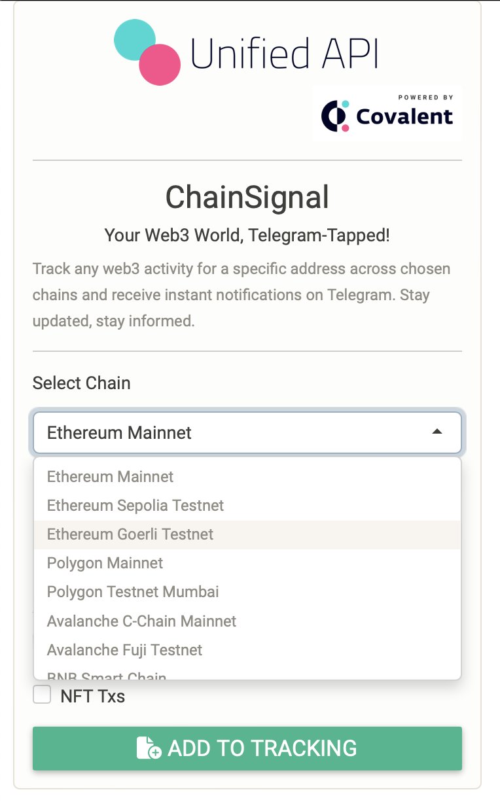
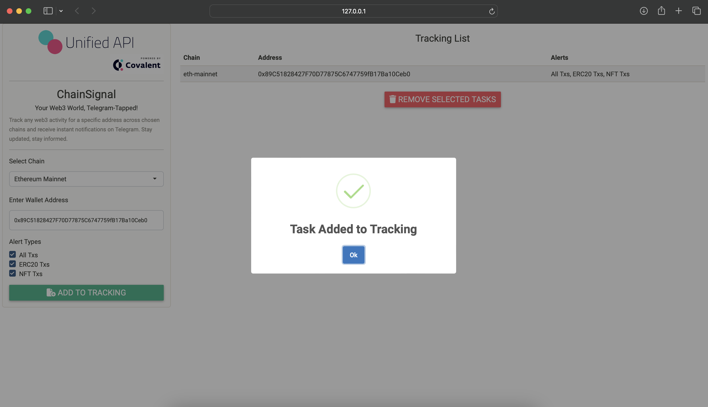

# ChainSignal
Your Web3 World, Telegram-Tapped!

## [App Walkthrough on YouTube](https://www.youtube.com/watch?v=Lioy-HFxiwQ) <<< Click Here

<hr>

### Walkthrough

#### 1. Open R and install the requirements using

```
install.packages("shiny")
install.packages("shinydashboard")
install.packages("shinycssloaders")
install.packages("shinyWidgets")
install.packages("shinyjs")
install.packages("telegram")
install.packages("httr")
install.packages("tidyr")
install.packages("lubridate")
install.packages("DT")
```

#### 2. Clone this repo and set the R path to the repo.

```
setwd("~/Desktop/ChainSignal)
```

#### 3. Setup Telegram Bot Credentials following and put them in `processBatch.R` file

```
tbot_token <- "**********:***************************-*******"
tbot_channel <- "**********"
```


<div align="center">R Telegram Configuration</div>
<br>

#### 4. [Setup Covalent Unified API Key and put in `processBatch.R` file](https://www.covalenthq.com/docs/unified-api/) <<< Click Here

```
covkey <- "***_****************************"
```

#### 5. Run the Background Job

```
Rscript processBatch.R
```


<div align="center">Background Job</div>
<br>


#### 6. Open R and run the Shiny Dashboard

```
library(shiny)
runApp()
```


<div align="center">Dashboard</div>
<br>

#### 7. Select Chain and Enter Address and Put what type of notifications to receive and add task to tracking

```
library(shiny)
runApp()
```


<div align="center">Select Chain</div>
<br>


<div align="center">Enter Address</div>
<br>


<div align="center">Task Added</div>
<br>

#### 8. Results


<div align="center">Dashboard</div>
<br>


<div align="center">ERC20 Tx Alert</div>
<br>


<div align="center">NFT Tx Alert</div>
<br>
